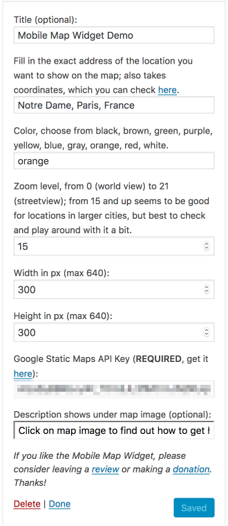
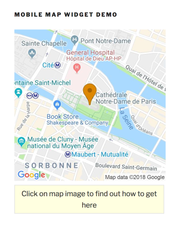

# Mobile Map Widget

   

###### Version 2.4.2
###### requires at least WordPress 4.4
###### tested up to WordPress 5.2.2
###### tested up to ClassicPress 1.0.1
###### Author: [Pieter Bos](https://github.com/senlin)
###### [Stable Version](https://wordpress.org/plugins/so-mobile-map-widget/) via WordPress Plugins Directory
###### [Plugin homepage](https://so-wp.com/plugin/mobile-map-widget)

This WordPress widget adds a mobile-optimised Google Static Map Image with a colored pin centered on a destination of your choosing.

## Description

Mobile Map Widget is meant for websites that target browsing via mobile devices. This widget adds a mobile-optimised Static Google Maps Image with a colored pin centered on your destination. Once clicked it opens the Google mobile maps website where you can fill in your Current Location if it is not already there. Then you can see the directions from your location to the destination as well as the map with the route of your choice. Optimised for mobile use. Google Static Maps API-key is required.

The reason we developed the Mobile Map Widget as a plugin, is because while implementing the widget for a mobile framework we were building for the hospitality industry, we realised that this widget can come in handy for many other scenarios too. It can for example be added to a company website to help people find the office location from wherever in the city they are. A travel information site can use it to include maps of tourist attractions, bars and restaurants can use it, you can use it to direct people to your new home, it can even come in handy for if you organise a party with a location that is kept secret till the very last moment!

Once activated you can go to your Widgets (in the backend under Appearance or via the Customizer) and drag the Mobile Map Widget to the sidebar of your choice. When you have placed the widget in a sidebar you need to fill in the following data:

 1. Title (optional).
 
 2. Destination. Use an address or use the coordinates. The map will also be automatically centered on this location.
 
 3. Color of the pin. You can choose from black, brown, green, purple, yellow, blue, gray, orange, red, white.
 
 4. Zoom level. From 0 (world view) to 21+ (street view); from 15 and up seems to be good for locations in larger cities, but best to check and play around with it a bit.
 
 5. Width in pixels. The image width will be automatically scaled to optimise for mobile screens.
 
 6. Height in pixels.
 
 7. [Google Static Maps API Key](https://cloud.google.com/maps-platform/#get-started) (**REQUIRED**). **Since July 16, 2018 a valid credit card is required by Google to sign up for the API-key**
 
 8. Description (optional). You can use this field to add a description under the map image, for example to inform your visitors that the image is clickable.
 
Save the widget and check the frontend of the site to see the map image. 

We support this plugin here on Github. Therefore, if you have any questions, need help and/or want to make a feature request, please [open an issue](https://github.com/senlin/so-mobile-map-widget/issues) here.

If you like the Mobile Map Widget plugin, please consider leaving a [review](https://wordpress.org/support/plugin/so-mobile-map-widget/reviews/?rate=5#new-post) or making a [donation](https://so-wp.com/donations). Thanks!

[Mobile Map Widget](https://so-wp.com/plugin/mobile-map-widget) plugin by SO WP.

## Frequently Asked Questions

### Where is the settings page?

You can stop looking, there is none. 
You can adjust all the necessary settings in the widget itself. 

A few settings are done by default: the scale of the image is set to 2, to optimise it for mobile resolutions and the link opens in a new tab.

Please note that the zoom, width and height parameters take a <strong>numerical</strong> value only.

### After adding the widget, why does it show some place in the middle of the North Atlantic Ocean?

The widget takes default settings, so what better location to choose than the very spot we operate from? Just replace the default setting with the address (or the coordinates) of the location you wish to add. The same goes for the other default values of the widget.

### Do I need a Google Static Maps API-key?

The Google Static Maps API-key is mandatory, get it at [Google Map APIs](https://cloud.google.com/maps-platform/). **Since July 16, 2018 a valid credit card is required by Google to sign up for the API-key**

### Nothing shows on the frontend

Did you enter a valid Google Static Maps API-key? **Since July 16, 2018 a valid credit card is required by Google to sign up for the API-key** Make sure to go through all the settings, because to be honest Google is not making it very easy to add the key and validate it properly...

### Where can I sign up for the Google Static Maps API-key?

See above.

### I cannot display a map larger than 640 x 640 pixels

That is a limit Google has put on the use of Static Maps images:

> Static Maps images can be returned in any size up to 640 x 640 pixels.

### When I use the Customizer to add the Mobile Map Widget I am seeing a lot of PHP Notices or nothing at all. What's wrong?

This only happens if you have not yet added the Google Static Maps API Key. You will need to [generate a new API key](https://cloud.google.com/maps-platform/) and add it to the widget settings. Once you have, the widget will automatically auto-refresh (WP 4.5 and above) and you will now see a map instead.

## License

* License: GNU Version 2 or Any Later Version
* License URI: http://www.gnu.org/licenses/gpl-2.0.html

## Donations

* Donate link: https://so-wp.com/donations

## Connect with me through

[BHI Consulting for Websites](https://bohanintl.com/)

[SO WP](https://so-wp.com)

[WP Tips](https://bohanintl.com/wptips/)

[Github](https://github.com/senlin) 

[LinkedIn](https://www.linkedin.com/in/pieterbos83/) 

[WordPress](https://profiles.wordpress.org/senlin/) 

## Changelog

### 2.4.2

* November 1, 2018
* fix deprecated function to register the widget
* WP.org version: 20182.4.2

### 2.4.1

* October 29, 2018
* change link to find coordinates
* add details new Google API requirements
* edit readme files with new FAQ entries among others
* change some links due to renewal SO WP website
* clean up irrelevant screenshots
* add new screenshots
* verified compatibility WP 5.0

### 2.4.0

* June 1, 2017
* change default location and pin color
* clean up tabs and spaces
* remove redundant language files
* verified compatibility WP 4.8

### 2.3.1

* April 12, 2017
* change http links to https, props [@senatorman](https://wordpress.org/support/users/senatorman/)

### 2.3.0

* November 29, 2016
* fix typo in settings that link to help map to get coordinates
* update URL to help map
* remove version check
* tested up to WP 4.7

### 2.2.0

* March 31, 2016
* implement selective refresh support for Customizer (WP 4.5 feature)
* adjust FAQ
* bump minimum required WP version up to 4.2

### 2.1.0

* July 7, 2015
* in WP 4.3 PHP 4 style constructors are deprecated, the plugin contained such a constructor, therefore replaced with PHP 5 style constructor

### 2.0.1

* changed logos
* new banner image for WP.org Repo by [Sylwia Bartyzel](https://unsplash.com/sylwiabartyzel)

### 2.0.0

* The location field now also takes an address (credits Google Maps Widget - https://www.googlemapswidget.com/)
* Add transient (credits Google Maps Widget - https://www.googlemapswidget.com/)
* Adjust FAQ
* Tested up to WP 4.0-beta2
* Bump minimum required WP version up to 3.8

### 1.4.0

* Change input type to number for zoom, width and height to address [issue #2](https://github.com/senlin/so-mobile-map-widget/issues/2) and adjust FAQ
* Add `format=jpg` to map parameters to allow for the smallest size and progressive loading of the image
* Fix typo textdomain function
* Move minimum required WP version up to 3.7

### 1.3.2

* Made sure that Widget Preview (WP 3.9 feature) works for the plugin

### 1.3.1

* Tested up to WP 3.9-alpha
* Change format version numbers
* Add widget default values to get rid of `undefined index` error

### 1.3.0

* change text domain to prepare for language packs (via Otto - http://otto42.com/el)

### 1.2.0

* Add version check
* Update minimum required version (WP 3.6)
* Compatible up to 3.7.1
* add .pot and .po files
* [HTML5 Validation](https://github.com/so-wp/so-mobile-map-widget/issues/3) suggested by [jecdk](https://github.com/jecdk)
* add [visual refresh parameter](https://github.com/so-wp/so-mobile-map-widget/issues/2)

### 1.1.0

* added optional description field

### 1.0.0

* release version

## Screenshots

Preview of the widget in the backend and on the frontend.

---

